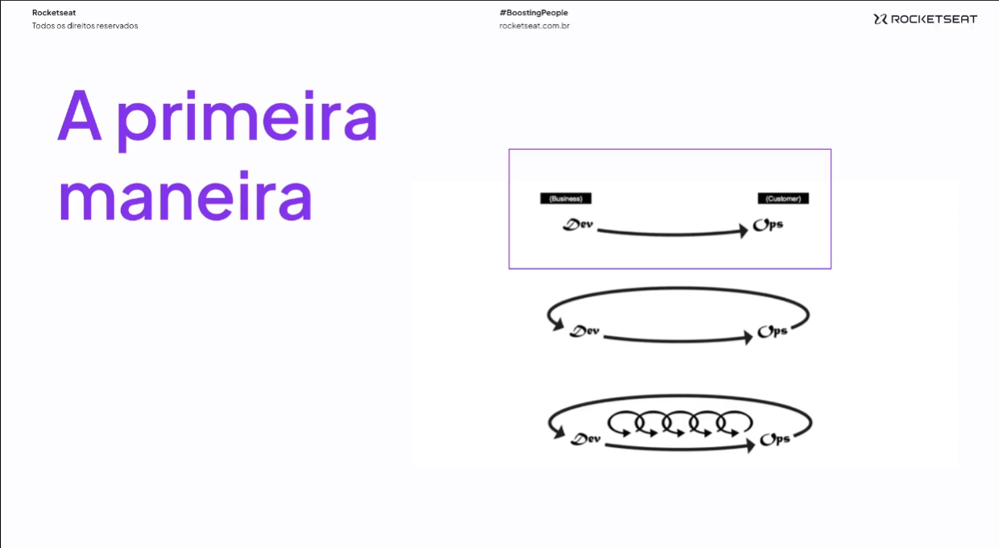
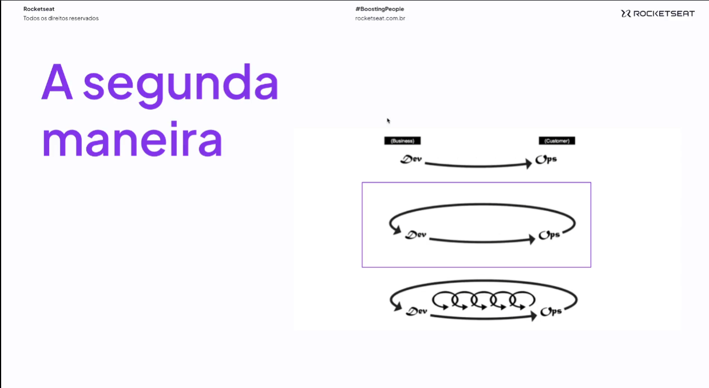
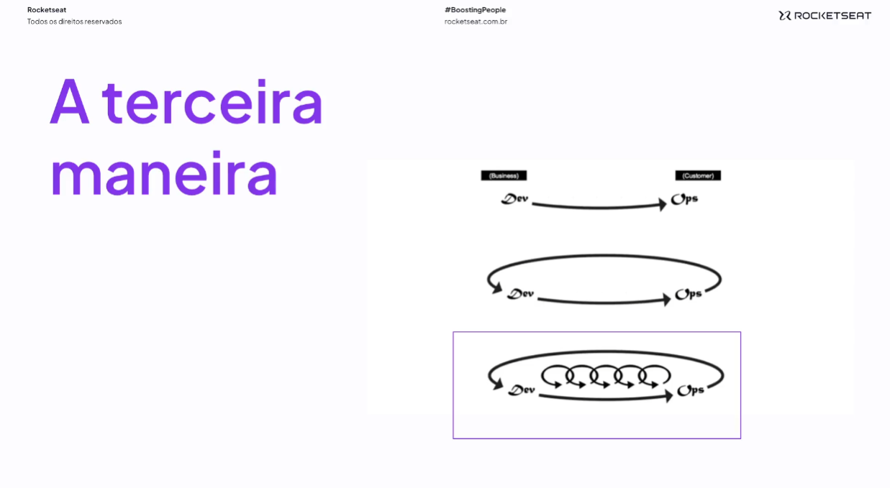

# Conhecendo as três maneiras

> Veio do livro - [O projeto fenix](https://www.amazon.com.br/projeto-f%C3%AAnix-Gene-Kim/dp/8550801895)

## 1. Maneira

- Acelerar o fluxo de desenvolvimento
- Foco em visibilidade, transparência no que foi feito e no que será feito na aplicação, visando não ter pessoas Herois no time
- Otimização constante
- Intervalos concisos, deploys de maneira constante
- Automatização

## 2. Maneira

- Feedback constante entre fluxos de trabalhos
- Deteção de erros
- Incorporar conhecimento

## 3. Maneira

- Foco em produtividae
- Aprendizado organizacional
- Features locais e globais
