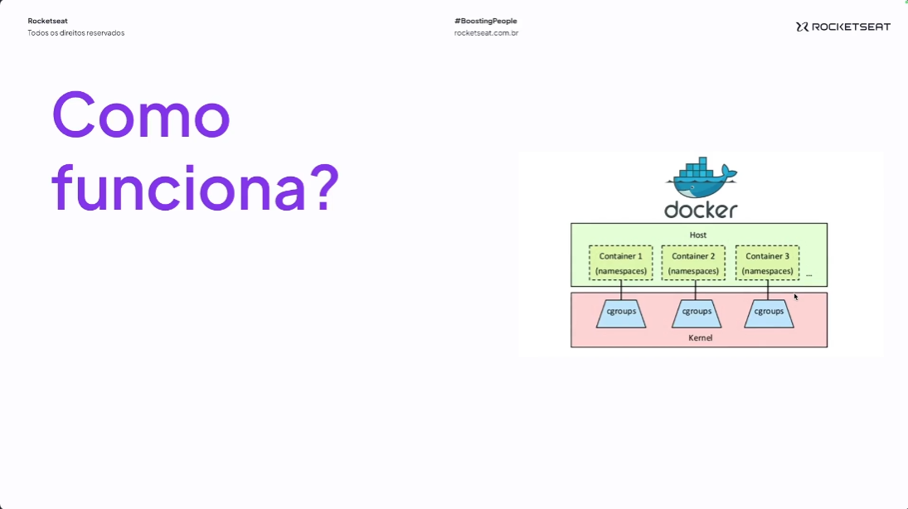

# 1. Iniciando com containers

## O que é um container ?

- Ambiente Isolado
- Compartilha um host
- Contém todos os elementos necessários para rodar uma aplicação
- LXC (Linux Container)
-

## E as maquinas virtuais ?

- Roda tudo na mesma máquina
- Possui seu próprio S.O.
-

## O que é o docker ?

- Surgiu há cerca de 15 anos
- Escrito em GO
- Interface para lidar com containers
- Utiliza o kernel do linux
- Baseado em imagem
- Facilita o ciclo de entrega
- Leve e portátil

## Isolamento



- CGroups
  - Funcionalidade que permeite controle sobre processo, usado para impor limite de cpu e affins
- Namespace
  - Container so enxerga os seus próprios processos, arquivos e rede
  - Para que o sistema seja executado de maneira separada
- Unshare
  - Execução de processos isolados sem a necessidade de um container

## Open Container Initiative - OCI

- Estrutura de governança
- Visa facilitar a interoperabilidade
- Garante padrões mantendo a flexibilidade
- Runtime;Image;Distro

> Dica de estudo para estudos de runtime [RunC](https://github.com/opencontainers/runc)

### Objetivos

- Promover contêiners agnósticos
- Portabilidade

## Principais formas de trabalhar com container

### Aleternativas

- Docker
- LXC
- Podman
- Containerd
- LXD

### Comando

- Instalar o [complete command do docker](https://docker-docs.uclv.cu/machine/completion/#zsh)

- Para lidar com imagens docker

```bash
docker image <comando>
```

- Para lidar com containers docker

```bash
docker container <comando>
```

- Docker Build
  - Cria a imagem docker

```bash
docker build .
```

- Docker Run
  - Executa a imagem docker

```bash
docker run <nome da imagem>
```
