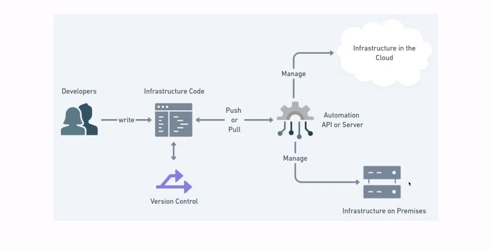

# Infra as Code 

- Declaração de todos os recursos via código  
- Faciclita a manutenabilidade de toda a infraestrutura 
- Automatiza todo o fluxo de criação, edição e remoção de um recurso
- Tas visibilidade do que está sendo usado 

# Git Ops

- Incirpora fluxos de SCM no contexto operacional 
- Evita o famoso "Só vou alterar no console"
- Proporciona uma fonte unica da verdade 
- Controle de versão em todo o fluxo 

# Declarativo x Imperativo

## Declarativo 
O que precisa fazer
- Define estado desejado 
- Engloba todos os recursos do fluxo
- Mantém estados passados no histórico
- Facilita póssiveis deleções futuras

## Imperativo
Como precisa fazer
- Define os comandos para criar o recurso
- Necessário execução em ordem 
- Em alguns casso é possivel manter o histórico do que foi feito 

# Gerenciadores de recursos e suas respectivas clouds 
1. AWS e CloudFormation
2. Azure e ResourceManeger
3. GCP e DeployManager

# Plumi 
- Visa facilitra a adoção do IAC dentro da nuuvem 

